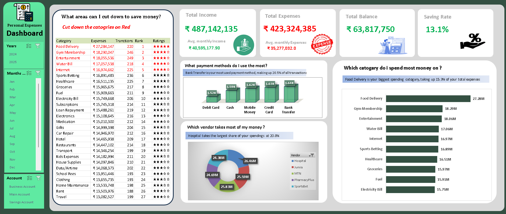

# 💰 Personal Finance Data Analysis (Excel)

## 📌 Project Overview

This project focuses on analyzing personal finance data to understand income, expenses, and savings patterns. Using Microsoft Excel, the data was cleaned, structured, and visualized to generate meaningful financial insights.

---

## 🎯 Objectives

* Track income and expense patterns
* Identify major spending categories
* Analyze monthly financial trends
* Evaluate savings behavior
* Build a dashboard for financial insights

---

## 🛠️ Tools & Technologies

* Microsoft Excel

  * Pivot Tables
  * Charts & Graphs
  * Slicers
  * Data Cleaning & Formatting
  * Functions (SUM, IF, etc.)

---

## 📊 Key Analysis Performed

* Total income vs total expenses
* Category-wise expense analysis (Food, Rent, Travel, etc.)
* Monthly spending trends
* Savings analysis and balance tracking
* Expense distribution across categories

---

## 📈 Dashboard Features

* Interactive filters for dynamic analysis
* Visual charts for expense breakdown
* Monthly trend analysis
* Easy-to-understand financial summary

## 💡 Key Insights

* Identified highest spending categories
* Observed monthly fluctuations in expenses
* Evaluated savings consistency
* Highlighted opportunities to optimize spending

## 📂 Dataset

The dataset includes:

* Date
* Income
* Expense Category
* Amount
* Payment Type

## 🚀 Conclusion

This project demonstrates my ability to analyze financial data and derive actionable insights using Excel. It highlights skills in data cleaning, analysis, and dashboard creation.

## 🎥 Project Demo

## 🔗 Future Improvements

* Automate expense tracking using Python
* Build advanced dashboards using Power BI
* Add predictive analysis for future expenses

⭐ If you like this project, feel free to star the repository!

